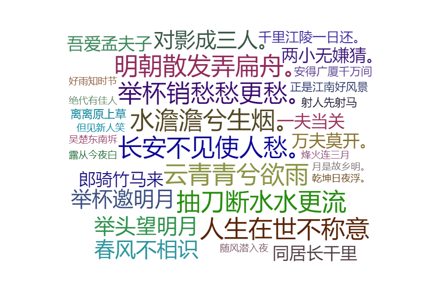
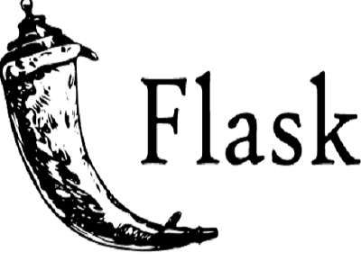
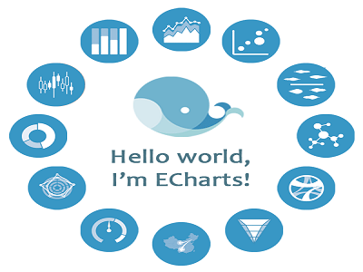

# Python-可视化 数字唐诗project介绍
> 备注：这是研究生一年级上学期Python统计分析与可视化的大作业


## 小组成员以及分工：
1. **李华勇（201721198598）**：负责网站搭建和项目协调分工
2. **朱思齐（201721198578）**：负责添加`Pyecharts`图表
3. **申资卓（201722198326）**：负责数据分析和唐诗分词
4. **程&nbsp;&nbsp;&nbsp;&nbsp;玥（201721198579）**：负责编写介绍和总结
## github文件介绍：
* ` 数字唐诗.pptx`：项目演示文件
* `tangpoemshow文件夹`：项目代码
	* `manage.py`：网站启动代码
	* `app文件夹`：网站文件
	* ....

项目文件树如下：
```bash
项目:.
│   manage.py
│   tree.txt
│
├───.idea
│   │   encodings.xml
│   │   misc.xml
│   │   modules.xml
│   │   tangpoemshow.iml
│   │   vagrant.xml
│   │   workspace.xml
│   │
│   ├───dictionaries
│   │       Liangs.xml
│   │
│   └───inspectionProfiles
└───app
    │   data.py
    │   views.py
    │   __init__.py
    │
    ├───all_data_files
    │   ├───shuowenjiezi
    │   │       all-chars.txt
    │   │
    │   └───tangshicilin
    │           adj.txt
    │           n.txt
    │           nl.txt
    │           ns.txt
    │           nt.txt
    │           v.txt
    │
    ├───mycharts
    │   │   constants.py
    │   │   ShiRenGuanXi.py
    │   │   ShuoWenJieZi.py
    │   │   SiChouZhiLu.py
    │   │   __init__.py
    │
    │
    ├───static
    │   ├───css
    │   │       bootstrap.min.css
    │   │       docs.min.css
    │   │       github-markdown.css
    │   │       normalize.css
    │   │       patch.css
    │   │       styles.css
    │   │
    │   ├───echarts
    │   │       Afghanistan.js
    │   │       Albania.js
	(此处省略616个文件)
    │   │       Zimbabwe.js
    │   │
    │   ├───images
    │   │   │   favicon.ico
    │   │   │
    │   │   ├───about
    │   │   │       jishu.png
    │   │   │       poem.png
    │   │   │       techstack.png
    │   │   │
    │   │   └───index
    │   │           1.png
    │   │           2.png
    │   │           3.png
    │   │           4.png
    │   │           bootstrap.png
    │   │           Echarts.png
    │   │           FlaskLogo.png
    │   │
    │   ├───js
    │   │       bootstrap.min.js
    │   │       docs.min.js
    │   │       ie-emulation-modes-warning.js
    │   │       ie10-viewport-bug-workaround.js
    │   │       jquery.min.js
    │   │
    │   └───pdf
    │           des_words.pdf
    │
    ├───templates
    │       404.html
    │       500.html
    │       about.html
    │       base.html
    │       bootstrapBase.html
    │       index.html
    │       readme.txt
```
## 项目简介：
>通过对《全唐诗》、CBDB数据库的语言文字的数据统计，研究分析唐诗用字用词的特点和感情色彩、唐代诗人的人际关系，研究丝绸之路上唐诗的特点变化和唐代主要商贸城市的风貌

唐诗泛指创作于唐朝的诗。唐诗是中华民族最珍贵的文化遗产之一，是中华文化宝库中的一颗明珠， 同时也对世界上许多民族和国家的文化发展产生了很大影响，对于后人研究唐代的政治、民情、风俗、文化等都有重要的参考意义和价值。
### 项目目标：
唐诗风采的变化也直观地反映出不同文明之间的相交相融。 丝绸之路上的贸易除了丝绸织物以外，也带去了华夏民族先进的农耕技术与器具，推动着丝绸之路上的游牧文明向农耕文明的过渡。 王建《凉州行》——`“蕃人旧日不耕犁，相学如今种禾黍。驱羊亦著锦为衣，为惜毡裘防斗时”`， 就反映了丝绸之路上的游牧民族织衣耕种的新生活。丝绸之路贸易的繁荣还刺激了游牧民族畜牧业和商业的迅速发展， 白居易《阴山道》——`“五十匹缣易一匹，缣去马来无了日”`，说的就是中唐以来丝绸之路游牧民族与唐王朝频繁的马绢贸易， 当时的私人贸易量达到了惊人的程度。

本项目目标如下：

1.  通过对**《全唐诗》**语言文字的数据统计，研究分析唐诗用字用词的特点和感情色彩；
2.  借助**中国历代人物传记资料库CBDB**研究唐代诗人的人际关系
3.  对**丝绸之路**沿线唐诗进行分类分析，研究丝绸之路上唐诗的特点变化和唐代主要商贸城市的风貌


### 技术介绍：
本项目后台基于Flask框架，数据显示部分使用pyEcharts，前端使用Bootstrap进行界面美化。下面简单介绍下这几个技术：
#### Flask


Flask是一个使用Python编写的轻量级Web应用框架。基于Werkzeug WSGI(PythonWeb服务器网关接口（Python Web Server Gateway Interface，缩写为WSGI) 是Python应用程序或框架和Web服务器之间的一种接口，已经被广泛接受, 它已基本达成它的可移植性方面的目标) 工具箱和Jinja2 模板引擎。 Flask使用BSD授权。 Flask也被称为“microframework”，因为它使用简单的核心， 用extension增加其他功能。Flask没有默认使用的数据库、窗体验证工具。 然而，Flask保留了扩增的弹性，可以用Flask-extension加入这些功能：ORM、窗体验证工具、文件上传、 各种开放式身份验证技术。
#### pyEcharts


ECharts，缩写来自Enterprise Charts，商业级数据图表，一个纯Javascript的图表库， 可以流畅的运行在PC和移动设备上，兼容当前绝大部分浏览器 （IE6/7/8/9/10/11，chrome，firefox，Safari等），底层依赖轻量级的Canvas类库ZRender， 提供直观，生动，可交互，可高度个性化定制的数据可视化图表。创新的拖拽重计算、数据视图、 值域漫游等特性大大增强了用户体验，赋予了用户对数据进行挖掘、整合的能力。

pyecharts 是一个用于生成 Echarts 图表的类库。 使用pyEcharts可以直接将Python代码转化为Echarts的JavaScript代码，简化Echarts和Python项目的集成。 pyecharts可以非常方便地和Flask集成，完全可以使用Flask调用pyecharts动态生成图表同时插入其他html元素，返回给浏览器。
#### Bootstrap


Bootstrap是一组用于网站和网络应用程序开发的开源前端（所谓“前端”，指的是展现给最终用户的界面。 与之对应的“后端”是在服务器上面运行的代码）框架，包括HTML、CSS及JavaScript的框架，提供字体排印、 窗体、按钮、导航及其他各种组件及Javascript扩展，旨在使动态网页和Web应用的开发更加容易。

要在Flask中使用BootStrap需要借助Flask-Bootstrap扩展。 Flask-Bootstrap 把 Bootstrap 打包进一个 扩展，这个扩展主要由一个叫 “bootstrap”的蓝本（blueprint）组成。它也可以创建链接从一个CDN上引用Bootstrap。
